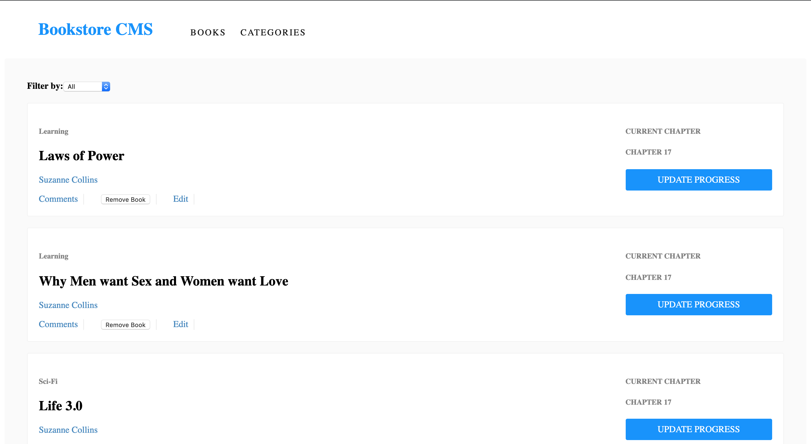

# Bookstore-CMS

> Bookstore-CMS. [Live demo](https://adnan-james-bookstore.herokuapp.com/)

## Table of Contents

- [React-calculator](#React-calculator)
  - [Table of Contents](#table-of-contents)
  - [Background](#background)
  - [Requirements](#requirements)
  - [Install](#install)
  - [Author](#author)

## Background

# This is a Library Management system built with React and Redux.

## Requirements

- Node.js

- React

- React-DOM

- React-Create-App

- npm

- CSS

- ES6

## Install

- Clone this repo https://github.com/AdnanAfsari/Bookstore-cms

- `cd` to cloned repository folder `Bookstore-cms`

- in terminal run `yarn install` or `npm install`

- Run `npm start` to stat the app in development mode

- Run `npm test` to start the test runner

## Author

- [Adnan Afsari](https://github.com/AdnanAfsari)
- [James Okunlade](https://github.com/JamesOkunlade)

